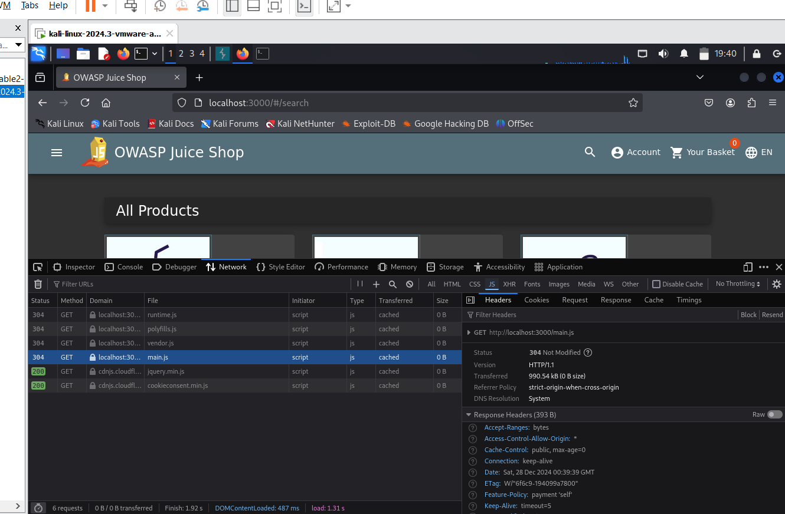
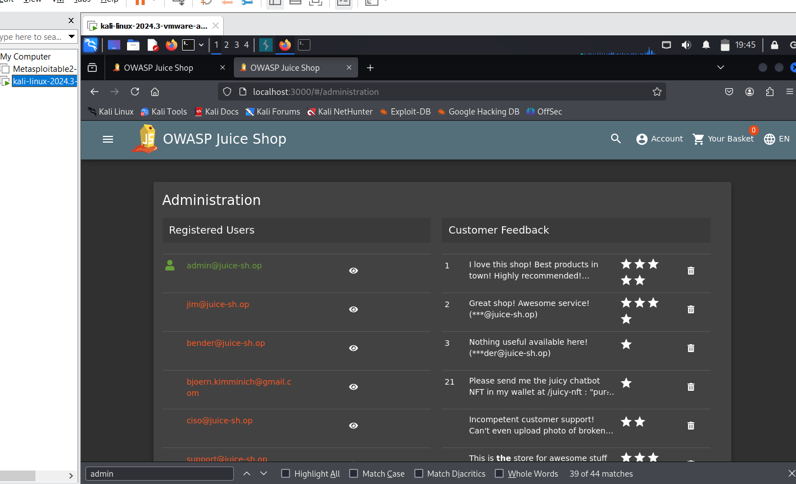
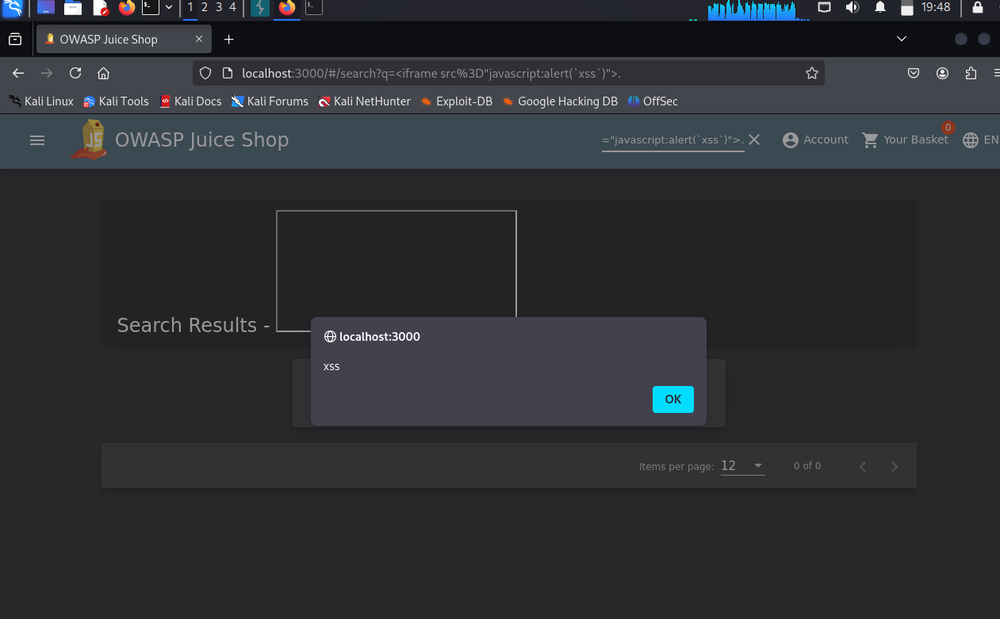

# Summary:

found  sql injection via https://juice-shop.herokuapp.com in user login i used the payload admin' or 1=1 -- ' which would bybass Authentication.

## Steps To Reproduce:

1- visit https://juice-shop.herokuapp.com/
2- go to userlogin
3-inject the payload admin' or 1=1 -- '
4-observe the alert of sqli
6-observe the Authentication bybass and successful login
## Supporting Material/References:

https://drive.google.com/file/d/1BYfCcTyLB7Ds0v6ne00GwQzgW-fC-7r3/view?usp=sharing

# Summary:

Identified an XSS vulnerability on the website: https://juice-shop.herokuapp.com. I injected a malicious script in the search bar, leveraging the payload <iframe src="javascript:alert(`xss`)">. which successfully executed and demonstrated the vulnerability.

## Steps To Reproduce:

1- visit https://juice-shop.herokuapp.com/
2- go to userlogin
3-inject the payload <iframe src="javascript:alert(`xss`)">. into the relevant input field.'
4-Observe the execution of the XSS payload, confirming the vulnerability.
## Supporting Material/References:

https://drive.google.com/file/d/1BYfCcTyLB7Ds0v6ne00GwQzgW-fC-7r3/view?usp=sharing

